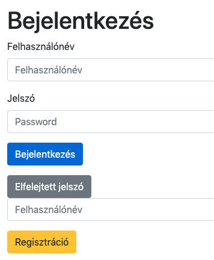
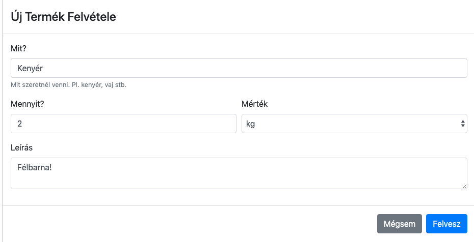
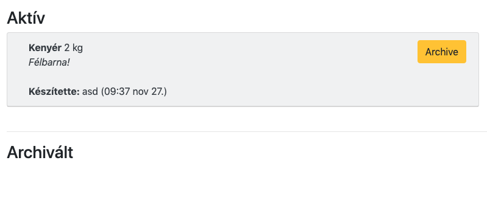
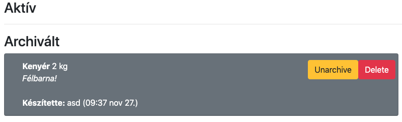
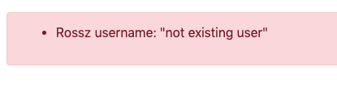
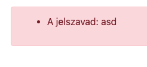

# NodeJSHomeWork Grocery List

It is my homework for Server Side JavaScript subject on BME. It is a Grocery List app, that you can add items, and you can check and delete them.

## It uses:
- Express
- Middlewares
- Mongo DB Atlas
- Mongoose
- EJS
- Chai
- Sessions

## Screenshots:

### Login

***

### New Item

***

### Dashboard with active item

***

### Dashboard with archived item

***

### Not found user error msg

***

### Password remember msg

